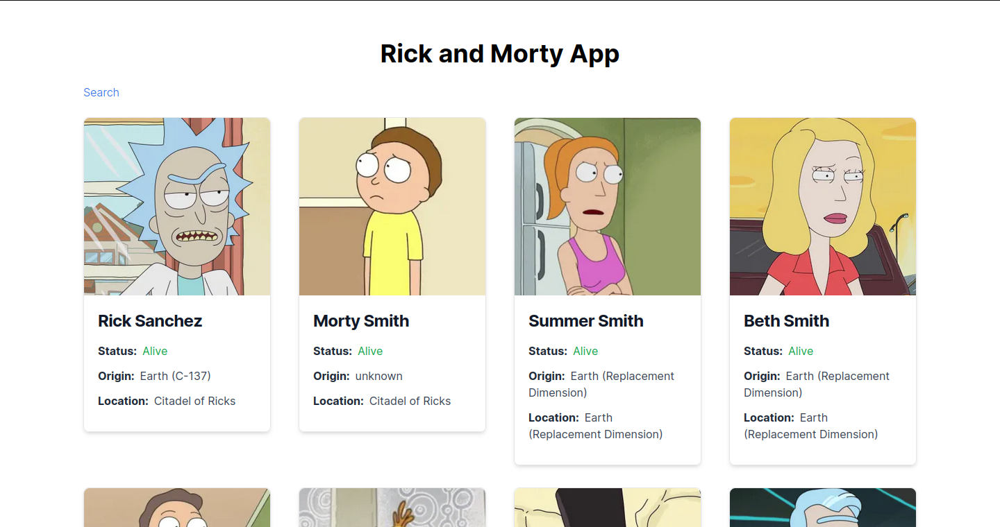

# Prueba Tecnica Veflat
## Breve Resumen
La aplicación está compuesta por un Frontend hecho en Nextjs, Typescript y Tailwind. Contiene el siguiente orden de carpetas: 

- components: Están contenidos todos los componentes de React, así como los componentes UI que están contenidos a lo largo del proyecto.

- hooks: Contiene los custom hooks, lógica que reutilizo a lo largo de las páginas del proyecto.

- services: Contiene las interfaces, y los servicios para traer los datos de la API

El flujo de datos es simple, en la página Home del proyecto, obtengo los datos iniciales de la API y los renderizo al cliente. En la página Search busco los characters teniendo en cuanto los siguientes parámetros de busqueda: name y status. En ambas vistas renderizo el componente CharacterItem para visualizar información detallada de los character.

## Screenshot


## Instalación
Preferiblemente tener instalada una versión LTS de Node.js para evitar errores de incompatibilidad.
```
// Instalamos los paquetes:
$ npm install
```
```
// Corremos el servidor en modo de desarrollo
$ npm run dev
```